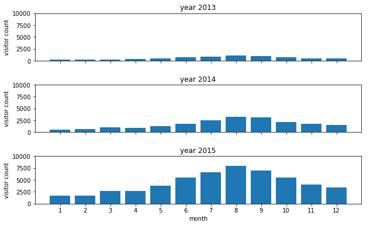
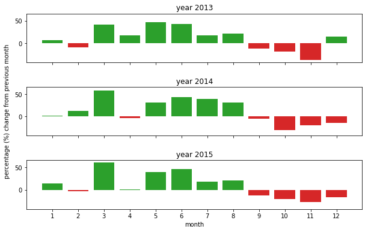
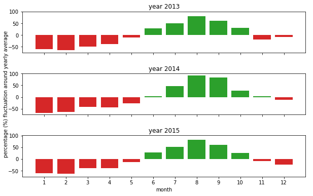
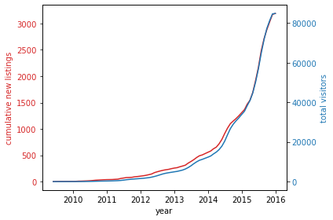
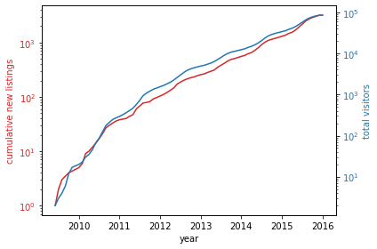
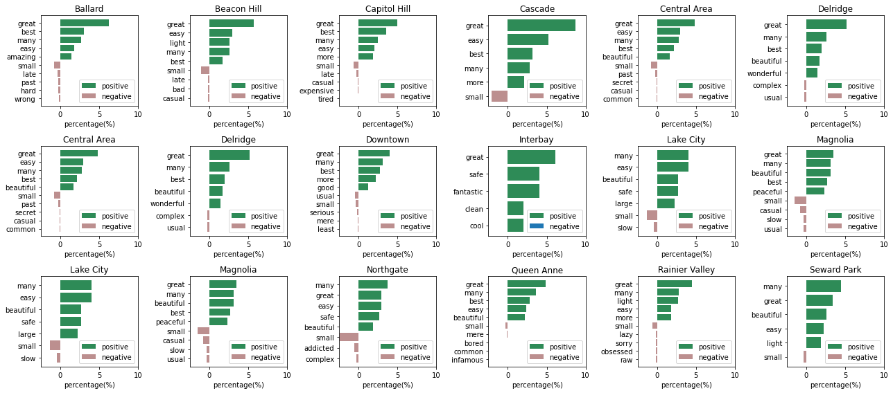
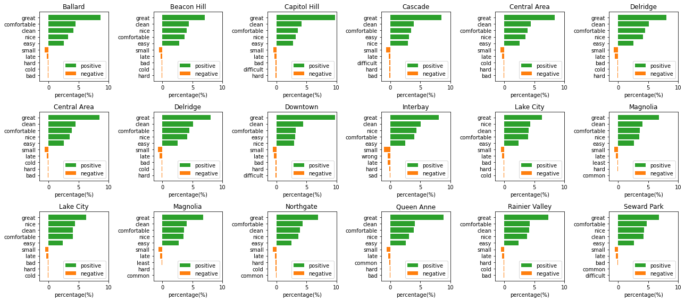

## Data and Sentiment Analyses on Seattle Airbnb Open Data

Author: Heng Li

LinkedIn: www.linkedin.com/in/hengli700 <br>
Medium: https://medium.com/@hengli700


### 1. Libraries used:
```numpy``` and ```pandas``` for computations and data imports/storage <br>
```matplotlib``` for data visualization <br>
```textblob``` and ```ntlk``` for natural language processing and sentiment analyses
### 2. Motivation
Airbnb is one of many travelers' preferred choices to book stays visiting places from busy cities to national parks. The Airbnb open datasets contain a large amount of information on how the vacation rental market rises over the past few years, price fluctuations between hot and off seasons, traveler's feelings about rental properties. Utilizing these information embedded in the dataset can greatly benefit businesses, from Airbnb to individual rental property owners, on room for improvements and enhance visitors' user experience about the platform and listings. 
<br><br>
In this Seattle Airbnb data set, data analyses and visualizations were used to answer the following questions:
- **What are the busiest times of the year to visit Seattle? By how much do prices spike?**
<br><br>
  This helps Seattle area business owners and Airbnb to get ready for the hot season (business decision), as well as helps visitor in planning travel accordingly to avoid peak seasons (personal choice).
<br><br>
- **Is there a general upward trend of both new Airbnb listings and total Airbnb visitors to Seattle?**
<br><br>
  Trends in Airbnb listing and visitor growth from 2009 to 2016 were distilled from listings and reviews datasets.
<br><br>
- **Can you describe the vibe of each Seattle neighborhood using listing descriptions?**
<br><br>
  Sentiment analysis via textblob and NLTK was performed to describe the vibe of major Seattle neighborhoods. This helps the potential visitors to select the neighborhood to stay which match their personal taste.
<br><br>
- **How does visitors feel about the listings in each Seattle neighborhood using review comments?**
<br><br>
  Sentiment analysis was used on visitor review comments to extract what are the pros and cons on listed properties in each neighborhoods. This helps the rental property owners to identify room for improvement and enhance visitors' staying experience.
<br><br>
### 3. Files in the repository:
```
└── Project_1_Seattle_Airbnb
	├── Data_and_Sentiment_Analyses_on_Seattle_Airbnb_Open_Data.ipynb
					# entry point to the jupyter notebook code, analyses, and visualizations
	├── calendar.csv
					# downloaded calendar dataset
	├── listings.csv
					# downloaded listings dataset
	├── reviews.csv
					# downloaded reviews dataset
	├── readme.md
					# readme file
	└── visualizations
		├── monthly_visitor_change_from_a_month_prior.png   
					# monthly_visitor_change_from_a_month_prior
		├── monthly_visitor_counts.png   
					# monthly_visitor_counts
		├── monthly_visitor_fluctuation_around_annual_average.png  
					# monthly_visitor_fluctuation_around_annual_average
		├── neighborhood_listing_feelings.png   
					# neighborhood_listing_feelings
		├── neighborhood_vibes.png  
					# neighborhood_vibes
		├── trends.png   
					# trends
		└── trends_log_scale.png   
					# trends_log_scale
```

### 4. Summary of results and analyses
- **The busiest time to visit Seattle is**:<br>
  Busiest time (hot season) is from June all the way through October.<br>
	<br>
	
	<br>
	
	<br>
	
<br>
- **Average price spike across all listings in 2016 in Seattle area from normal to hot season is: 7.94%** <br>

	General trends of both new Airbnb listings and total Airbnb visitors to Seattle
	Both new Airbnb listings and total Airbnb visitors to Seattle show upward trends. In particular, growths in both new listings and visitors show drastic increases since 2013, and they are in sync with one another, indicating the rental market is constantly meeting new demands generated by Airbnb platform.
	<br>
	
	<br>
	
<br>
- **The vibe of each Seattle neighborhood using listing dataset**: <br>
	Based on the top five positive adjectives, most neighborhood groups shared similar vibes such as "great", "many", and "easy". Some of the neighborhood groups also have special vibes, such as "amazing" for Ballard, "safe" for Interbay and Lake city, and "peaceful" for Magnolia.
	<br>
	
<br>
- **Visitors feelings about the listed property in each Seattle neighborhood**:<br>
	There are common positive feelings ("great", "comfortable", "clean", "nice", etc.) and negative feelings ("small", "late", "cold", "hard", etc.) on listed rental properties in each neighborhood.
	<br>
	